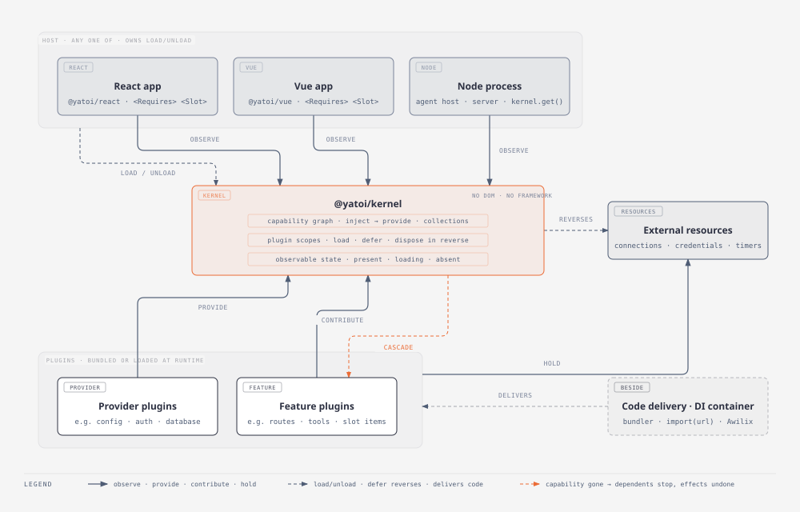

# Yatoi

[](https://github.com/yatoi-dev/yatoi-js/actions/workflows/ci.yml)
[](https://www.npmjs.com/package/@yatoi/kernel)
[](https://github.com/yatoi-dev/yatoi-js/blob/main/LICENSE)

**Plugins that come apart cleanly.**
A small kernel for any modern JavaScript runtime with the two properties
a plugin system needs — <u>remove a plugin and *everything it did is undone*;</u>
<u>a plugin runs *only while what it needs exists*</u> — and React and Vue bindings
that only ever observe it.

> **A yatoi is the loose tenon in Japanese joinery**: a separate piece,
> belonging to neither board, cut to fit slots in both and inserted to hold
> them together. A hired hand.
>
> It carries load without being glued in place, and the joint comes apart without
> damaging either side. yatoi provides the slots, the fit, and the guarantee that pulling 
> a piece out leaves nothing behind.



The host observes the kernel and calls `load`/`unload` outside render;
plugins act on it through their scope; neither imports the other. The
kernel is the only joint.

## The problem

Composition breaks when what an app is made of stops being a build-time
decision. Two things go wrong:

- **A parent must import its children.** In React or Vue, nothing can add
UI to a surface it doesn't own. Outside a component tree, the same
coupling is a host hard-coding its agent's tool list or server's route
table.
- **Nothing is required, only read.** React context, Vue
`provide`/`inject`, and conventional DI resolution expose values to
consumers; they do not treat a disappearing dependency as an event that
deactivates each dependent and reverses its effects. Consumers keep a
stale or absent reference instead.

Add a third, quieter one: long-lived things that aren't UI — sockets,
schedulers, agent runners — need a lifecycle that can be reversed.

## Two properties

yatoi is built around two forms of composability: temporal and spatial.
In plain words:


|              | What it means                                   | yatoi                                                                                                                                                         | Elsewhere                                                                                                                                                                                    |
| ------------ | ----------------------------------------------- | ------------------------------------------------------------------------------------------------------------------------------------------------------------- | -------------------------------------------------------------------------------------------------------------------------------------------------------------------------------------------- |
| **Temporal** | Remove a plugin and everything it did is undone | Every effect a plugin makes through its scope — `defer`, `provide`, `contribute` — carries its inverse, which the kernel holds and runs in reverse on dispose | `useEffect`/`onUnmounted` cleanup follows component lifecycle, not dependency availability; DI containers dispose a whole scope, not an individual dependency edge                           |
| **Spatial**  | A plugin runs only while what it needs exists   | `inject` declares requirements; activation is *derived* from what's present, and pulling a requirement unloads every dependent, in dependency order           | None. Context, `provide`/`inject`, and `resolve()` are reads, not requirements                                                                                                                |


Together these are **spatiotemporal composability**. UI frameworks have
the temporal half for render-tree nodes; DI containers have it for whole
scopes. Neither has the spatial half. yatoi adds both — as a kernel that
knows nothing about any framework, with React and Vue subscribed to it.

The terms come from *A Programming Paradigm for Spatiotemporal
Composability* (Shi, Zhang, Cui — [arXiv:2608.25512](https://arxiv.org/abs/2608.25512))
and its reference implementation, [Cordis](https://github.com/cordiverse/cordis),
which powers DeepSeek Harness. yatoi keeps the vocabulary — effects,
inject, scope — and takes no dependency on it.

### What's the difference?
The difference is who owns the runtime. Cordis owns its own; UI schedulers
— React's concurrent renderer, Vue's flush queue — can observe state
between two steps of an update, and a Node host reading the kernel between
turns must not see a half-done plugin either. So the kernel does all its
async behind a synchronous facade: disposers are *invoked* synchronously,
only their promises are awaited, and every observer reads a synchronous
snapshot that can't tear — `useSyncExternalStore` in React, `shallowRef`
in Vue, direct `kernel.state` / `get` / `list` reads in Node — with service
state explicit as `present | absent | loading`. That constraint is the
design work here, and the reason the kernel is small rather than a port.

## In thirty seconds

```ts
import { createKernel, defineService, definePlugin } from '@yatoi/kernel'

const Clock = defineService<{ now(): number }>('clock')   // a real symbol, not a string

const clockPlugin = definePlugin({
  name: 'clock',
  provides: [Clock],
  setup(scope) {
    const id = setInterval(tick, 1000)
    scope.defer(() => clearInterval(id))            // temporal: undone on unload
    scope.provide(Clock, { now: () => Date.now() }) // temporal: removed on unload
  },
})

const syncPlugin = definePlugin({
  name: 'sync',
  inject: [Clock],                                  // spatial: runs only while Clock is present
  setup(scope) { scope.defer(subscribe(scope.get(Clock))) },  // typed non-null
})

const kernel = createKernel()
kernel.load(syncPlugin, clockPlugin)   // order doesn't matter; sync activates when Clock appears
kernel.unload(clockPlugin)             // sync disposes first, cleanups in reverse
kernel.load(clockPlugin)               // both come back, sync with a fresh scope
```

The same two properties, projected into a render tree (React shown; Vue
provides the equivalent behavior — see [the guide](docs/guide.md)):

```tsx
// React today: a read that can go stale
const clock = useContext(ClockContext)   // Clock | undefined once the provider is gone
clock!.now()                             // and here is the crash

// yatoi: a requirement the subtree cannot exist without
<Requires of={[Clock]} fallback={<Installing />}>
  {(clock) => <Dashboard clock={clock} />}   {/* non-null; unmounts when Clock goes */}
</Requires>

// yatoi: UI a plugin pushes into a surface it doesn't own
<Slot name="sidebar.item" collapsed={collapsed} />   {/* host never imports the contributors */}
```

`<Requires>` is spatial composability in the render tree. `<Slot>` is
where both meet: a contribution is a reversible effect (it disappears with
its plugin) that the host reads reactively.

> **Never mutate the kernel during render.** `kernel.load`, `unload`,
> `provide`, `contribute` belong in event handlers, effects, or outside
> the UI framework entirely. React's concurrent rendering and Vue's flush
> queue can observe work between steps; plugin loading is not rollback-able.
> There is no runtime guard — this is the one rule you carry yourself. In a
> non-UI host, the same rule reads: mutate between turns or requests, never
> inside one.

## Why now

What an app is made of is increasingly a runtime decision:

- **Marketplaces** let users install and remove capabilities.
- **Extensible products** ship a core while customers override or add pieces.
- **Agents** install tools, generate views, and revoke them again without an
app author in the loop.

All three need removal to be *total* and activation to follow what is
actually present. A page reload is not a lifecycle — and agents do not
reload pages.

The examples exercise that model in four hosts:

- a React todo app whose calendar plugin can arrive as a separately built
ESM file;
- the same application shape in Vue;
- a Node agent host whose tools disappear when a credential is revoked;
- a `node:http` server whose routes follow its database connection.

## Where yatoi fits

yatoi does not replace framework context, lazy loading, DI, or code
delivery. It supplies the lifecycle layer those tools do not: dependencies
can disappear, dependents deactivate, and contributed effects are reversed
automatically.

**Framework context and lazy loading.** React context and Vue
`provide`/`inject` are reads: nothing deactivates when a provider goes
away. `lazy()` / `defineAsyncComponent` load code; nothing reverts it.
That's the temporal half for render-tree nodes only, and no spatial half.
They are the right tools right up until something has to be removable.

**DI containers.** A container answers *how to build* an object graph;
yatoi answers *when things exist*. Conventional containers resolve values
and dispose scopes — they do not notify and deactivate each dependent when
one dependency goes away, or expose `loading` / `absent` as first-class
states. They compose: one kernel scope, one container scope. See
[Beyond UI](docs/beyond-ui.md).

**Module Federation and single-spa.** Those are delivery and isolation —
and they deliberately avoid shared lifecycle, because team independence
was the goal. Neither property, on purpose. yatoi is the layer that goes
on top when the pieces *do* need to compose.

**Building it in-house.** VS Code's `DisposableStore` and
service decorators are the temporal half done right and part of the
spatial half. Every large extensible app rebuilds that core, and
none extracts it, because the interesting part — the contribution surface
— is always app-shaped. yatoi is the ~1,000 lines you'd write anyway,
extracted, with the React bridge tested under StrictMode on a concurrent
root and the Vue bridge asserting unmount/remount explicitly so you don't
have to discover the lifecycle bugs yourself.

## Packages


| Package                                    | What                                                                                                                   | Runs in              |
| ------------------------------------------ | ---------------------------------------------------------------------------------------------------------------------- | -------------------- |
| [`@yatoi/kernel`](packages/kernel)         | Plugins, services, scope tree, cascade unload; no framework, DOM, or Node APIs                                         | Any modern JS runtime |
| [`@yatoi/react`](packages/react)           | `<KernelProvider>`, `useService`, `<Requires>`, `usePlugin`, `useContributions`                                        | React 18/19          |
| [`@yatoi/slots`](packages/slots)           | Framework-neutral slot contract: the `Slots` interface, `SlotName`, `SlotProps`, `slot()`                              | Any modern JS runtime |
| [`@yatoi/react-slots`](packages/react-slots) | React binding for `@yatoi/slots`: `contribute()`, `<Slot>`                                                           | React 18/19          |
| [`@yatoi/vue`](packages/vue)               | `provideKernel`/`<KernelProvider>`, `useService`, `<Requires>`, `usePlugin`, `useContributions`                        | Vue 3                |
| [`@yatoi/vue-slots`](packages/vue-slots)   | Vue binding for `@yatoi/slots`: `contribute()`, `<Slot>`                                                               | Vue 3                |


**Stop at the layer you need**. A shell developer drives the kernel from
config and unit-tests it without rendering anything. An app developer
writes `usePlugin` and `<Slot>` and never touches the kernel. If either of
those stops being true, the API is wrong.

## The honest cost

yatoi introduces a second kind of dependency. Imports say which code a
module uses; a plugin's `inject` and `provides` declarations say which
runtime capabilities must exist before it can run.

That runtime graph is what makes late installation, automatic activation,
and cascade unload possible. It is also harder to follow than ordinary
imports because your bundler and editor cannot show the whole graph.

The kernel makes it inspectable through `pluginState`, `state`, `list`, and
`on('error')`. A future devtools package can make the graph visible, but it
cannot remove the underlying complexity.

Read [Pitfalls](docs/pitfalls.md) for more details.

## Status

v0.1 is implemented and tested, but not yet published to npm.

- **Kernel:** runs in plain Node with no DOM; a torture test covers a
service unloading while dependents are mid-async.
- **Bindings:** React runs under `<StrictMode>` on a concurrent root; Vue
asserts unmount/remount explicitly. Adding Vue required no kernel changes.
- **Verification:** 125 tests across the kernel, bindings, slots, and
non-UI examples.
- **Versioning:** the first release is 0.1.0 for all six packages. Patches
then move independently; minors move all six together as a new contract.
While the major is 0, a minor may break and a patch will not — pin to
`~0.1.0` if that matters to you.
- **1.0:** when the spec's conformance table stops growing and a second
implementation passes it.

See [CHANGELOG.md](CHANGELOG.md) for releases and [ROADMAP.md](ROADMAP.md)
for devtools, Suspense integration, token versioning, Dart, Solid, and what
is deliberately out of scope. To help, start with
[CONTRIBUTING.md](CONTRIBUTING.md); [AGENTS.md](AGENTS.md) has the full
repository conventions.

## Documentation

- [Concepts](docs/concepts.md) — the mental model in one sitting: tokens,
plugins, scopes, cascade unload, the two mounting modes, slots vs.
collections.
- [Guide](docs/guide.md) — how to do each thing, with snippets.
- [Pitfalls](docs/pitfalls.md) — the ways this bites, and why.
- [Architecture](docs/architecture.md) — how the code implements the
design; read before changing the library.
- [Design brief](docs/design.md) — what we're building, what we're not,
and why each decision went the way it did.
- [Protocol spec](docs/spec.md) — the language-neutral contract a kernel
and binding must satisfy; what a port to another language is built
against.
- [Example app](examples/todo/README.md) — todo + an installable calendar
plugin, exercising the kernel, React binding, and slots end to end;
chapter 2 loads the plugin from another origin.
- [Vue example app](examples/todo-vue/README.md) — the same app, chapter 1
only, ported to `@yatoi/vue` + `@yatoi/slots` + `@yatoi/vue-slots` — what a Vue plugin
author actually writes.
- [Agent-host example](examples/agent-host/README.md) — a Node program,
no React and no DOM, where skills are plugins and revoking a credential
cascades its tools out before the model's next turn.
- [Server example](examples/server/README.md) — a plain `node:http` host
where routes and jobs follow an async database capability and config reload.
- [Beyond UI](docs/beyond-ui.md) — how the same capability graph applies
to agent runtimes, long-running servers, and other non-UI hosts.
- [Release process](docs/releasing.md) — package contents, versioning,
tarball verification, and the npm publishing checklist.


## Development

Node ≥ 22.22.2, pnpm 9 (`packageManager` is pinned).

```bash
pnpm install
pnpm test          # all packages; kernel/slots in node, react/react-slots/vue/vue-slots in jsdom under StrictMode
pnpm typecheck
pnpm build         # tsc -b → dist/ in each package
pnpm pack:check    # build and audit the six npm tarballs without publishing
pnpm --filter yatoi-example-todo dev   # the example app; see its README
```

Tests and the example resolve `@yatoi/*` straight to source, so no build
step sits in the inner loop. Commit conventions are in
[AGENTS.md](AGENTS.md#commit-conventions).
